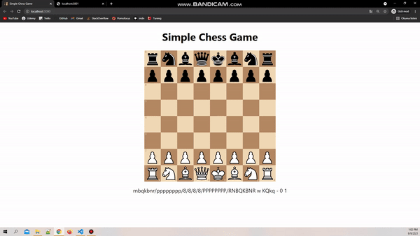

# Simple Chess Game

A simple chess game for web with React.js.

> ❗ **This project is under development and not yet completed.**

### Tech Stack

    Typescript
    Docker
    React
    Redux
    Socket.IO

### Setup & Libraries

    https://redux.js.org/introduction/getting-started#create-a-react-redux-app
    https://github.com/willb335/chessboardjsx
    https://github.com/jhlywa/chess.js

### Execution
    1) server: npm run start
    2) client: npm start

### Requirements

- Authentication and authorization (You can use passport to satisfy this requirement)
- Users can sign up and sign in
- Users can add other users to friends
- Gameplay mechanics will be implemented according to chess rules
- BONUS: Users can play chess game with other users via socket

### Screenshots

